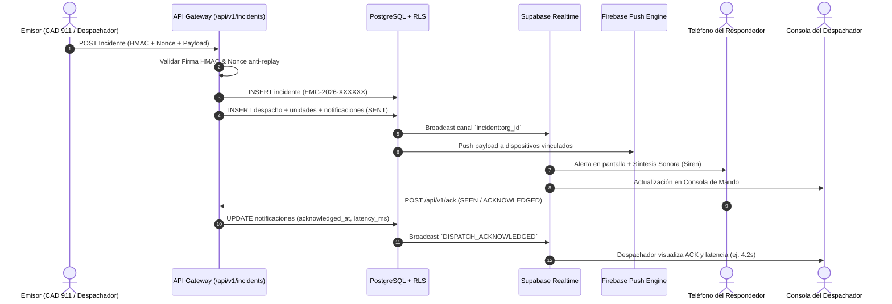

# RESPONDE — Arquitectura del Sistema de Despacho de Emergencias

## 1. Visión General y Principios de Diseño

RESPONDE está diseñado como un **CAD (Computer-Aided Dispatch) de Misión Crítica**, optimizado para la coordinación táctica de cuerpos de bomberos, brigadas de rescate y servicios de emergencias médicas.

### Principios Fundamentales
1. **Disponibilidad Continua y Resiliencia**: El sistema tolera pérdidas de conectividad temporal en terreno mediante almacenamiento local (Local State / Service Workers) y reconexión automática.
2. **Cero Suposición de Entrega (Zero Assumption of Delivery)**: Ninguna notificación de emergencia se considera recibida hasta que el dispositivo receptor emite una confirmación de entrega (`DELIVERED`) o lectura (`SEEN`) y el usuario presiona activamente `ACKNOWLEDGED`.
3. **Idempotencia Criptográfica**: Las integraciones externas (CAD 911, botones de pánico, sensores) pueden reenviar solicitudes ante fallos de red sin riesgo de duplicar incidentes.
4. **Separación Estricta de Privilegios**: Ninguna credencial administrativa (`service_role`) se expone al cliente. Toda mutación sensible pasa por políticas PostgreSQL RLS y Route Handlers validados.

---

## 2. Diagrama de Flujo Operacional

---

## 3. Máquina de Estados del Despacho y Respondedores

### Estados del Incidente
- `NEW`: Recibido pero sin validar.
- `VALIDATING`: En proceso de confirmación de datos o triaje telefónico.
- `DISPATCHED`: Alarma emitida, unidades asignadas y alertas enviadas a respondedores.
- `RESPONDING`: Al menos una unidad o personal clave confirmó y se encuentra en ruta.
- `ON_SCENE`: Primer vehículo o comandante en el lugar del suceso.
- `CONTROLLED`: Incidente controlado / sin riesgo de propagación.
- `CLOSED`: Incidente finalizado, unidades liberadas y bitácora cerrada.
- `CANCELLED` / `FALSE_ALARM`: Descartado por el despachador.
- `ESCALATED`: Elevado a comando superior tras agotar recursos o superar timeout.

### Ciclo de Vida de Notificación (ACK State Machine)

$$\text{PENDING} \xrightarrow{\text{push/socket}} \text{SENT} \xrightarrow{\text{device ping}} \text{DELIVERED} \xrightarrow{\text{app open}} \text{SEEN} \xrightarrow{\text{user action}} \begin{cases} \text{ACKNOWLEDGED} \\ \text{DECLINED} \\ \text{TIMEOUT} \end{cases}$$

---

## 4. Estructura de Componentes

- **Gateway de Ingesta**: Validador de esquemas Zod y firmas HMAC-SHA256 con protección contra ataques de repetición.
- **Motor de Protocolos**: Catálogo dinámico de procedimientos estándar (Incendios, HazMat, Rescate Vehicular, etc.) con asignación sugerida de material mayor y tiempos límite de ACK.
- **Motor de Escalamiento**: Evaluador de alertas desatendidas que detecta automáticamente notificaciones que exceden el $T_{\text{ack}}$ configurado.
- **Generador de Tono de Emergencia (Web Audio API)**: Sintetizador de tonos Hi-Lo de dos frecuencias (720Hz / 960Hz) con vibración háptica sincronizada.
- **Bitácora Inmutable**: Registro de auditoría `audit_logs` con trigger PostgreSQL que bloquea operaciones `UPDATE` y `DELETE`.
